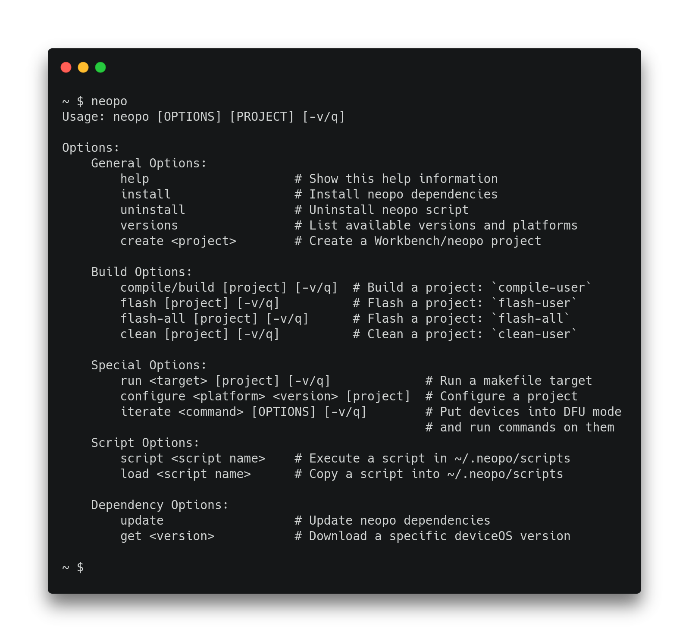

[](https://travis-ci.org/nrobinson2000/neopo)
[](https://community.particle.io/t/neopo-a-lightweight-solution-for-local-particle-development/56378?u=nrobinson2000)



## Features

- Builds Particle projects locally without any overhead.
- Compatible with Particle Workbench and Particle CLI.
- Installs and manages necessary Particle dependencies.
- Built with Python using only the standard library.
- Supports Linux, macOS, Windows, and Raspberry Pi.
- Supports tab completion to assist development.

## Installation

The easiest way to install neopo is to open a Terminal and run:

```bash
$ bash <( curl -sL https://git.io/JfwhJ )
```

Alternatively, you can clone this repository, add the directory to your `PATH`, and run the install command:

```bash
$ git clone https://github.com/nrobinson2000/neopo
$ export PATH="$PATH:$PWD/neopo"
$ neopo install
```

On Windows the installation process is more involved but not very difficult: [Windows Installation](windows.md)

## Usage

[Quick Reference](quick-docs.md)

[Complete Reference](full-docs.md)